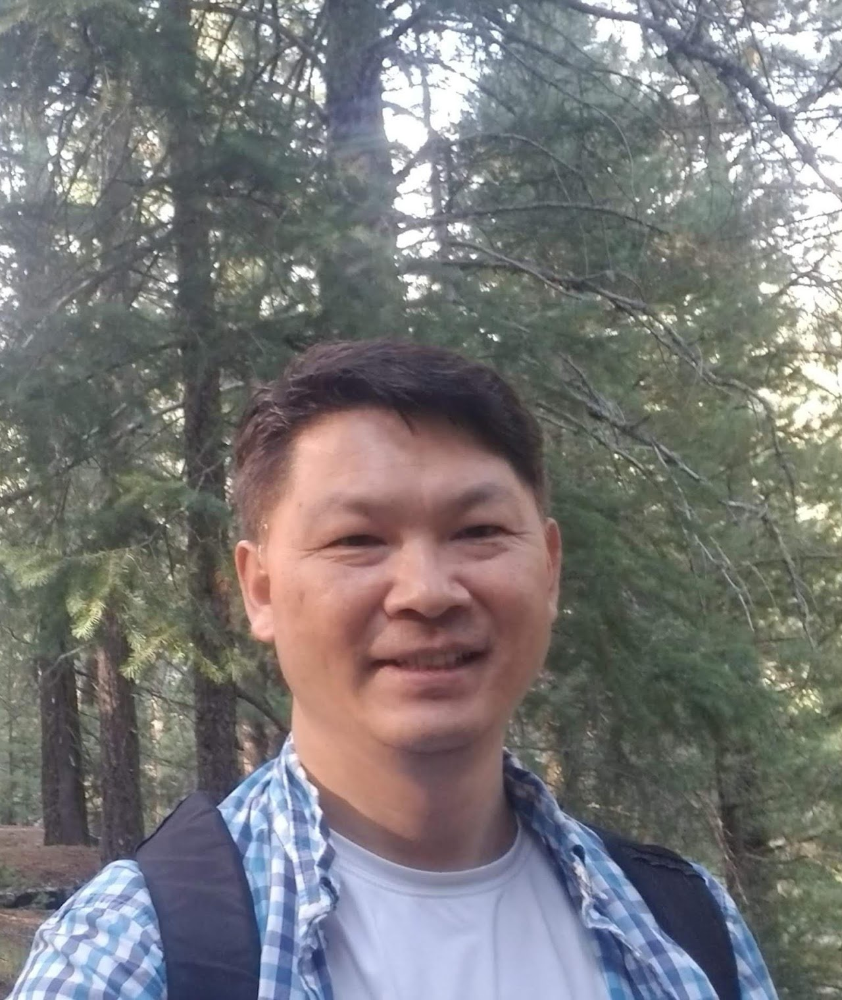

# About Me

On advancing my expertise in cybersecurity and undertaking critical challenges, my goal is to deliver my insights and findings to the pedagogical and research activities so that it would tremendously help produce future
leaders who would effectively manage our national cybersecurity issues.
Hello, I am an Assistant Research Scientist, working for the [SEFCOM](https://sefcom.asu.edu/) lab and [Center for Cybersecurity and Trusted Foundations (CTF)](https://globalsecurity.asu.edu/cybersecurity-and-trusted-foundations) at [Arizona State University](https://www.asu.edu/) as. I received my Ph.D. from [Yonsei University](https://www.yonsei.ac.kr/en_sc/index.jsp) in South Korea. My research interests lie in the filed of mobile and wireless network security issues like Telco (5G), Access Control, Blockchain, Digital Forensics, and Vehicle security.

🎓 Ph.D.Computer Science, Yonsei University, Seoul, Korea,  2011 
🎓 M.S. Computer Science, Yonsei University, Seoul, Korea,  2001

## Latest News
 1. Our paper "**Targeted Privacy Attacks by Fingerprinting Mobile Apps in LTE Radio Layer**" has been accepted in [IEEE IFIP DSN  2023 (June 27-30, Porto, Portugal)](https://dsn2023.dei.uc.pt/)  This paper presents novel privacy attacks against LTE using machine learning to identify patterns in the communication between the UEs and eNBs without breaking into users' devices and the base station.

2. Our paper "**SpaceMediator: Leveraging Authorization Policies to Prevent Spatial and Privacy Attacks in Mobile Augmented Reality**" has been accepted in [SACMAT 2023 (June 7-9, Trento, Italy)](https://sacmat2023.fbk.eu/). We present a new approach for managing access control policies in a mobile augmented reality (MAR) application based on policy-governed MAR apps against space invasion, space affectation attacks, and privacy leaks.

3. Our Blockchain Patent application has been issued on Feb. 21, 2023 " S[ystems and Methods for Blockchain-Based Automatic Key Generation](https://patentcenter.uspto.gov/applications/17067426)" by USPTO. (Patent # 11588631)

4. Our NSF proposal has been awarded on August  29, 2022: "CICI: UCSS: ScienceAccess: Enabling Zero-Trust Resource Access Management for Scientific Collaborations  ", which will be collaborated with TAMU-CC. from Oct. 2022 to Sept. 2025. ([Award # 2232911, $591,644](https://nsf.gov/awardsearch/showAward?AWD_ID=2232911))

5. Our extended edition of the Dypoldroid paper has been accepted to [Information Systems Frontier](https://www.springer.com/journal/10796)s: "DyPolDroid: Protecting Against Permission-Abuse Attacks in Android" in August 2022. (Impact Factor: 5.261)

6. Our paper has been accepted to [Applied Energ](https://www.journals.elsevier.com/applied-energy)y, titled "[A Secure Distributed Ledger for Transactive Energy: The Electron Volt Exchange](https://doi.org/10.1016/j.apenergy.2020.116208)" in November 2020. (Impact Factor: 8.848)

7. Our team (Jaejong Baek, Sukwha Kyung, Gail-Joon Ahn) was recognized as the Most Innovative Capability in t[he Blockchain Innovation Challenge hosted by ASURE. The title of the project is "Cryptographic Key Management System using a Distributed Shared Ledger".](https://twitter.com/ASUREASU/status/1138645169828294656) (Patent issued)

8. Our paper "[Wi Not Calling: Practical Privacy and Availability Attacks in Wi-Fi Calling](https://adamdoupe.com/publications/wi-not-calling-acsac2018.pdf) " has been accepted in [ACSAC ’18, December 3–7, 2018, San Juan, PR, USA.](https://www.acsac.org/) In this paper, we analyze the security of Wi-Fi Calling specifications and discover several vulnerabilities that allow an adversary to track the location of users and perform DoS attacks.
